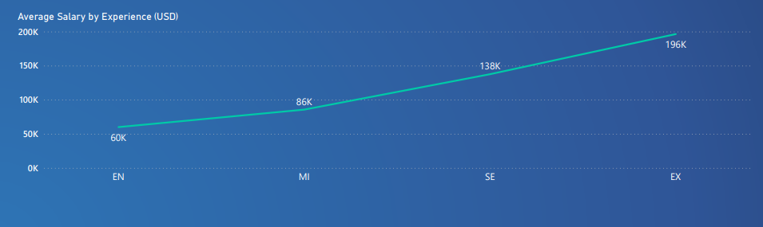

# Data Science Salary Insights Project

## A Data Analyst Project on salaries of individuals in the field of data science using Python for data extraction and transformation, with SQL being used for loading the data. 

# About
The main purpose of this project was gain skills in data analytics following some of the most popular tools used in industry. The dataset that was used for this project came from Kaggle. The dataset is a CSV file of salaries in the industry of data science. 

The data set contains the following information. 
- ID
- Work Year
- Experience
- Employement Type
- Job Title
- Salary
- Salary Currency
- Employee Location (country)
- Remote Ratio
- Company Location (country)
- Company Size

With this project I created a set of questions I planned to answer and throughout the following sections I will explain the steps I took to achieve this. 

# Preparing the data
The data set that came from Kaggle was intitially formatted as a CSV. My plan was to export this CSV into a MySQL database for easier analysis through SQL queries. 

## Python
I used the MySQL connector extension for Python to connect to my RDBMS in MySQL and transport this information to the server. With Python, I connected to a database created in MySQL workbench. Using the MySQL connector extension, I created a script that created a table with columns that matches the CSV file and populates it with correctly formatted data into my MySQL database. 

## SQL
With the data now in my MySQL server, I made a series of queries that provided me with insights about the data. The following section will present those queries along with my analysis. 

In the data set it can be noticed that the salaries were in different currencies. In order to analyze the data accurately, I created a function in MySQL to convert all the currencies into USD. This could of been easily done in Python but I was interested in better understanding SQL functions therefore I chose to do it in MySQL. The code is shown below. 

<code>CREATE DEFINER=`root`@`localhost` FUNCTION `convert_to_USD`(curr_num INT, curr_type VARCHAR(4)) RETURNS decimal(10,2)
    READS SQL DATA
    DETERMINISTIC
BEGIN
	DECLARE s DECIMAL(12, 2);
    
    IF curr_type = "EUR" THEN SET s = curr_num * 1.07;
    ELSEIF curr_type = "GBP" THEN SET s = curr_num * 1.20;
    ELSEIF curr_type = "HUF" THEN SET s = curr_num * 0.0028;
    ELSEIF curr_type = "INR" THEN SET s = curr_num * 0.012;
    ELSEIF curr_type = "JPY" THEN SET s = curr_num * 0.0075;
    ELSEIF curr_type = "CNY" THEN SET s = curr_num * 0.15;
    ELSEIF curr_type = "MXN" THEN SET s = curr_num * 0.054;
    ELSEIF curr_type = "CAD" THEN SET s = curr_num * 0.74;
    ELSEIF curr_type = "DKK" THEN SET s = curr_num * 0.14;
    ELSEIF curr_type = "PLN" THEN SET s = curr_num * 0.22;
    ELSEIF curr_type = "SGD" THEN SET s = curr_num * 0.75;
    ELSEIF curr_type = "CLP" THEN SET s = curr_num * 0.0013;
    ELSEIF curr_type = "BRL" THEN SET s = curr_num * 0.19;
    ELSEIF curr_type = "TRY" THEN SET s = curr_num * 0.053;
    ELSEIF curr_type = "AUD" THEN SET s = curr_num * 0.69;
    ELSEIF curr_type = "CHF" THEN SET s = curr_num * 1.08;
    ELSE SET s = curr_num;
    END IF;
RETURN s;
END</code>

# Data Analysis and Visualization

This screenshot shows the entire PowerBI dashboard that I created. I will be going through each of these graphs individually and showing the SQL commands that corresponded with the graph and what questions I wanted to answer with each.

## What is the Top 10 average salaries based on residence? 

SQL Command: SQL code find the average salary in USD of the top 10 countries and orders it from least to greatest based off the average salary. 

<code>SELECT employee_residence, AVG(convert_to_USD(salary, salary_currency)) AS avg_salary
FROM dsstats.dsstatstable
GROUP BY employee_residence
ORDER BY avg_salary DESC
LIMIT 10;</code>

In the top 10 countries, the **greatest** salary is **Malaysia** with an average salary of **200,000 USD**. The **least** is **Jersey** with an average salary of **100,000** USD. It is determined that the top 10 countries provide a salary that is well about the averages for these nations, making these countries highly desirable for individuals who are in the field of Data Science. 

## What are the top 10 most common jobs? What are the number of jobs and their average salaries?

SQL Command: SQL code to find the average salary in USD for the top 10 most common jobs, the number of jobs, and their salaries.

<code>SELECT job_title, COUNT(job_title) AS number_of_jobs, AVG(convert_to_USD(salary, salary_currency)) AS avg_salary
FROM dsstats.dsstatstable
GROUP BY job_title
ORDER BY number_of_jobs DESC
LIMIT 10;</code>

In the top 10 most common jobs, the **most common** job title is **Data Scientist** with **143 jobs** and an average salary of **$106,399.73**. The **least most common** job is **AI Scientist** with 7 jobs and an average salary of **65,288.58**. The title of "data scientist" being most common can likely be attributed to fact that data science is a general term used for the industry. This results in more jobs using this title and the overall average salary being higher since we are likely to see a greater range of values. In contrast "AI Scientist" was likely less prevalent due to the specifics of the title resulting in less titles and therefore a smaller range of values. 

## What are the percentage of jobs based off experience

- SE: Senior-level
- MI: Mid-level
- EN: Entry-level
- EX: Executive-level

SQL Command: SQL code to to find the percentage of jobs based on experience. 

<code>SELECT experience, (COUNT(experience) / 607 ) AS percent_jobs
FROM dsstats.dsstatstable
GROUP BY experience</code>

The **majority** of the jobs make up **Mid-level** and **Senior-level** positions with **46.13% and 35.09% respectively**. Entry-level jobs are less prevalent with **14.5%** and **Executive-level** being the least common with **4.28%**. The values indicate that the demand for data science jobs are with Mid-level and Senior-level positions. Additonally, Entry-level jobs are less common, likely due to companies looking for higher skilled employees and are less likely to have Entry-level positions. Finally, Executive-level is likely scarce due to employers requiring a minimal number of executives and the overall number of individuals with executive level experience being uncommon. 

## What is the average salary by experience?

- SE: Senior-level
- MI: Mid-level
- EN: Entry-level
- EX: Executive-level

<code>SELECT experience, AVG(convert_to_USD(salary, salary_currency)) AS avg_salary
FROM dsstats.dsstatstable
GROUP BY experience
ORDER BY avg_salary ASC;</code>

The data indicates that with increased experience, salary also rises. The highest average salary was seen with **Executive-level** positions with an average salary of **$196,388.65**. The lowest average salary is seen with **Entry-level** positions with an average salary of **$59,948.53**.

## Overall Insights

The overall insights concluded that the field of data science is very lucrative in terms of income. A majority of individuals who were in the Mid-level and Senior-level were making 6 figures. Additionally, within the top 10 countries, the average salary was all above six-figures. As a field, data science has a lot of incentive with its high salaries and diverse locations of potential employement. 

# Project Reflection

Throughout this project I gained two key insights myself. First, even with structured data, cleaning and developing outputs that are beneficial for analysis are relatively complex. Throughout my project I found that even simple cleansing such as converting currency to USD can be complicated, which makes me assume that real-world data is likely much harder to organize and clean. Second, data visualizations are extremely powerful. A visualization can speak a thousand words. With just my four visuals, I was able to describe the majority of my analysis much easier than I could of verbally. Additionally, visuals are much easier for non-tehnical individuals to understand and are required for data scientists to share their insights.

# Future Plans

I plan to do another data scinece project. In this new project I would like to learn some new frameworks such as pandas and matplotlib to analyze and create visualizations entirely in python. Additionally, I would like to learn and implement ML models in my new data analysis. I have created a project using NLP models and might revist that or learn new models entirely. 

